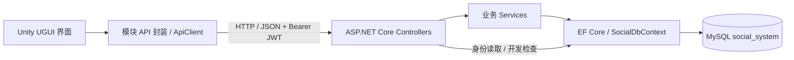

# 社交管理系统项目文档

整理日期：2026-09-22。本文描述当前源码中已实现的功能，包含第九阶段第二轮好友、聊天界面优化。第十阶段仅整理文档，不修改业务代码或数据库；测试结果引用已有记录，不代表本次重新执行测试。

事实来源为 [项目规范](../AGENTS.md)、实际源码、[数据库初始化定义](../database/01_init.sql) 和各阶段验证记录。历史文档中旧界面操作与当前代码不一致时，以当前实现为准。

## 1. 项目背景与目标

本项目是基于 Unity 的社交管理系统课程项目，用于展示客户端界面、HTTP 通信、身份认证、关系型数据库和后端业务处理的完整流程。

目标是让用户登录后查看身份信息、建立好友关系、进行文字私聊，以及发布动态、评论和点赞；同时通过分层代码、数据库约束和测试记录支持课程演示与答辩。开发优先保证可运行、核心功能完整、结构清晰和易于理解，不引入微服务等复杂架构。

当前交付为 Windows 本地演示项目。语音视频、文件传输、复杂群聊和云服务器部署不在已实现范围。注册已提供 API 和客户端调用方法，但没有独立 Unity 注册页面；用户搜索和个人资料编辑也未实现。

## 2. 系统整体架构



Unity 只通过现有 HTTP API 访问数据，不直接连接 MySQL。服务端从 JWT 获取当前用户 ID，不接受客户端指定发布者、发送者等身份来代替认证身份。

典型业务请求由视图发起，经 FriendApi、MessageApi 或 PostApi 调用统一 ApiClient，再由服务端控制器、服务和 EF Core 完成。身份读取和开发环境数据库检查也存在控制器直接使用 DbContext 的路径。

项目主要目录：

```text
project1/
├─ AGENTS.md
├─ README.md
├─ backend/
│  ├─ global.json
│  ├─ SocialSystem.sln
│  ├─ SocialSystem.Api/
│  ├─ SocialSystem.Api.Tests/
│  └─ scripts/
├─ client/
│  ├─ README.md
│  ├─ SocialSystem.Unity/
│  │  ├─ Assets/
│  │  ├─ Packages/
│  │  ├─ ProjectSettings/
│  │  └─ Build/                  本机 Windows 构建产物
│  ├─ scripts/
│  └─ Build/                    本机验证副本、日志和备份
├─ database/
│  ├─ 01_init.sql
│  ├─ 02_inspect.sql
│  └─ 03_verify.sql
└─ docs/                        状态、接口、设计和验证文档
```

Library、Temp、构建、截图和备份等本机生成内容不属于业务源码；被 Git 忽略的产物不保证在新克隆中存在。

## 3. 技术栈说明

| 层次 | 当前技术与版本 | 用途 |
| --- | --- | --- |
| 客户端 | Unity 6000.6.2f1、C# | Windows Editor / Windows Development Build |
| 界面 | UGUI 2.6.0 | 登录、主页及社交业务界面 |
| 网络 | UnityWebRequest、HTTP、JSON | 统一请求、Bearer 头、响应解析 |
| 后端 | .NET 9、ASP.NET Core 9，目标 net9.0 | REST API |
| SDK | 9.0.318，latestPatch | backend/global.json 固定大版本 |
| ORM | EF Core / Relational 9.0.20 | 实体映射、查询、事务 |
| MySQL Provider | Pomelo.EntityFrameworkCore.MySql 9.0.0 | EF Core 与 MySQL 连接 |
| 数据库 | MySQL 8.0.x；既有验证为 8.0.46 | InnoDB、utf8mb4 |
| 认证 | JwtBearer 9.0.20、HS256、Identity PasswordHasher | JWT 校验、密码哈希 |
| API 展示 | Swashbuckle.AspNetCore 10.2.3 | Development 环境 Swagger |
| 自动验证 | .NET 集成测试、Unity Play Mode、PowerShell 脚本 | 隔离数据库与真实 HTTP 回归 |

版本依据：[后端项目文件](../backend/SocialSystem.Api/SocialSystem.Api.csproj)、[SDK 配置](../backend/global.json)、[Unity 版本](../client/SocialSystem.Unity/ProjectSettings/ProjectVersion.txt)、[Unity 包配置](../client/SocialSystem.Unity/Packages/manifest.json)。项目不使用 EF Core 10 或 net10.0。

## 4. 后端结构

### 4.1 目录职责

| 目录 / 文件 | 职责 |
| --- | --- |
| Controllers | Auth、Friends、Messages、Posts 与开发环境 Health 路由、认证要求和 HTTP 结果 |
| Services | AuthService、FriendService、MessageService、PostService 的业务规则；TokenService 签发令牌；JwtSettings 校验配置 |
| Models/Entities | User、FriendRequest、Friend、Message、Post、Comment、Like，以及申请状态枚举 |
| DTOs | 请求验证与对外响应，避免直接返回数据库实体 |
| Data/SocialDbContext.cs | 7 个 DbSet |
| Data/Configurations | 表名、字段、主外键、索引、生成列和删除行为映射 |
| Data/UtcConnectionInterceptor.cs | 打开连接时设置会话时区为 UTC |
| Middleware/ApiExceptionHandler.cs | 统一异常响应，避免泄露连接信息和堆栈 |
| OpenApi/SwaggerAuthorizationFilter.cs | Swagger 认证要求展示 |
| Program.cs | 依赖注入、JWT、Swagger、EF Core 和中间件 |
| SocialSystem.Api.Tests | Auth、Friend、Message、Post 的集成测试 |
| backend/scripts | 隔离 MySQL 测试与认证人工验证脚本 |

入口见 [Program.cs](../backend/SocialSystem.Api/Program.cs)，实体映射见 [SocialDbContext.cs](../backend/SocialSystem.Api/Data/SocialDbContext.cs)。没有自动创建、删除或迁移现有数据库的启动逻辑。

### 4.2 认证、校验和数据一致性

注册将用户名规范化为小写；用户名唯一约束不区分大小写。密码使用 Identity V3 格式的 PBKDF2-HMAC-SHA512 哈希，210000 次迭代和独立随机盐，响应不包含密码哈希。

JWT 包含用户 ID、用户名、唯一令牌 ID 和时间声明。服务端验证签名、算法、issuer、audience 和有效期，时钟偏差为零。默认有效期 60 分钟；签名密钥必须是解码后至少 32 字节的 Base64 值。当前没有刷新令牌或服务端注销接口，客户端退出不等于撤销已签发令牌。

参数通过 DTO/DataAnnotations 与业务规则检查。好友操作用事务、按用户 ID 排序的行锁和唯一约束维护关系；消息发送检查并锁定相关用户，要求发送时仍为好友。评论、点赞和删除操作使用动态行锁协调并发。评论数、点赞数由查询计算，没有额外冗余计数列。

数据库相关异常返回 503，其他未处理异常返回 500；业务错误由控制器转换为相应状态码和 ProblemDetails。认证失败响应不保证都含业务错误 code。

### 4.3 配置与启动

本机配置使用 User Secrets，项目标识为 SocialSystem.Api-local-development，也可通过进程环境变量覆盖。必要配置：

| 配置键 | 说明 |
| --- | --- |
| ConnectionStrings:SocialSystem | 本机 MySQL 连接字符串，数据库 social_system |
| Jwt:SigningKey | 本机生成的随机 Base64 密钥 |
| Jwt:Issuer | 默认 SocialSystem.Api |
| Jwt:Audience | 默认 SocialSystem.Client |
| Jwt:ExpirationMinutes | 默认 60，合法范围 1–1440 |

环境变量对应 ConnectionStrings__SocialSystem、Jwt__SigningKey 等。真实密码和密钥不写入仓库或本文。首次配置参见 [后端说明](../backend/README.md) 与 [认证说明](auth-api.md)。

从项目根目录执行：

```powershell
Set-Location backend
dotnet restore SocialSystem.sln
dotnet build SocialSystem.sln --no-restore
dotnet run --project SocialSystem.Api --launch-profile http --no-build
```

http 启动配置使用 Development，默认地址为 http://localhost:5080。开发环境提供 /swagger 和 /swagger/v1/swagger.json。数据库应事先正确建立；应用启动不会初始化数据库。

## 5. Unity 客户端结构

### 5.1 场景与脚本

```text
Assets/
├─ Scenes/LoginScene.unity
├─ Scripts/
│  ├─ Network/    ApiClient、ApiResponse
│  ├─ Auth/       AuthDtos、AuthManager、TokenManager、
│  │              LoginSceneController、LoginSceneView
│  ├─ Main/       SocialAppController、HomeView
│  ├─ UI/         SocialUi、SocialTheme
│  ├─ Friends/    FriendApi、FriendsView
│  ├─ Messages/   MessageApi、ChatView、ConversationStore
│  └─ Posts/      PostApi、PostsView
├─ Editor/        ClientProjectSetup、ClientSmokeRunner
├─ Tests/         ClientConnectionSmokeTest、
│                 ClientSocialSmokeTest、ClientUiCapture
└─ UI/            预留资源目录
```

登录、主页、好友、消息和动态在同一个 LoginScene 中切换，不是多个已建好的独立业务场景。场景保留 ClientServices、Canvas、EventSystem 等引用；业务页面由脚本运行时创建，登录样式也在运行时应用。应进入 Play 查看最终界面。

[SocialAppController](../client/SocialSystem.Unity/Assets/Scripts/Main/SocialAppController.cs) 管理导航、忙碌状态和退出清理；[SocialTheme](../client/SocialSystem.Unity/Assets/Scripts/UI/SocialTheme.cs) 与 SocialUi 统一深色配色、中文字体、按钮和间距。用户正文按纯文本显示。

### 5.2 网络与登录流程

ApiClient 统一提供 GET、POST、DELETE、JSON 解析、Bearer 请求头和错误处理，默认超时 15 秒，处理 204 空响应，不自动重试写请求。

登录按钮调用 AuthManager.Login，检查响应和过期时间后把令牌保存在 TokenManager 内存中；随后请求 /api/auth/me，核对返回身份后进入主页。JWT 的密码学验证由服务端完成，客户端不能替代服务端验签。

JWT 不写入 PlayerPrefs。退出、401 或令牌到期会清理认证状态并返回登录；业务视图销毁后重新登录会重新创建。没有跨场景持久单例，也没有重启后的自动登录。

### 5.3 好友、聊天与本地数据

FriendsView 显示昵称、用户名，点击身份区域或“聊天”按钮把完整 FriendDto 交给 ChatView.OpenFriend。聊天页没有手动输入好友 ID 的入口；未选联系人时禁用输入和发送。

消息以左右气泡区分本人和对方，显示时间和多行正文，发送后滚动到最新消息，手动刷新尽量保留阅读位置。历史消息每次通过 HTTP 读取，无推送或自动轮询。

[ConversationStore](../client/SocialSystem.Unity/Assets/Scripts/Messages/ConversationStore.cs) 用 PlayerPrefs 保存联系人 ID、用户名、昵称和本地移除标记，按服务器地址与当前用户 ID 隔离；不保存正文、密码或 JWT。从好友列表打开过或在本机删除的联系人会保留入口，重新登录后可以读取已删除好友的历史。对方删除好友时，发送被 API 拒绝后切换为只读；重新加好友后从好友列表打开可恢复发送。

最近会话不是服务端完整会话目录。本机未记录且已删除的联系人、其他设备的联系人不会自动出现；更换地址、设备或清理 PlayerPrefs 会影响入口，但不会删除服务端历史消息。

### 5.4 客户端启动和构建

Unity Hub 打开 client/SocialSystem.Unity，打开 Assets/Scenes/LoginScene.unity 后 Play。默认服务器可在 ClientServices → ApiClient → Base Url 修改。本地 HTTP 配置用于 Editor / Development Build。

现有本机客户端路径为 client/SocialSystem.Unity/Build/SocialSystem.Client.exe，应保留同目录全部依赖，不能只复制 exe。构建脚本使用独立验证副本，其输出位置与发布到源工程 Build 的现有产物位置不同，详见第 10 节和 [客户端说明](../client/README.md)。

## 6. 数据库设计说明

数据库为 social_system，存储引擎 InnoDB，默认 utf8mb4 / utf8mb4_0900_ai_ci。时间列使用 DATETIME(6)，连接会话设置 UTC；DATETIME 本身不携带时区。

共有 7 张表、7 个主键、11 个外键、12 个 CHECK 约束和 3 个独立 UNIQUE 约束；likes 另以复合主键防止重复点赞。下列普通字段除明确标为可空者外均为 NOT NULL，生成列在非待处理状态下可返回 NULL。

### 6.1 表字段

| 表 | 字段与类型 |
| --- | --- |
| users | id BIGINT 自增主键；username VARCHAR(32)；password_hash VARCHAR(512)；nickname VARCHAR(32)；bio VARCHAR(200) 默认空串；avatar_key VARCHAR(64) 默认 default；created_at、updated_at DATETIME(6) |
| friend_requests | id BIGINT 自增主键；sender_id、receiver_id BIGINT；status TINYINT 默认 0；created_at DATETIME(6)；handled_at DATETIME(6) 可空；pending_low_id、pending_high_id BIGINT 虚拟生成列 |
| friends | id BIGINT 自增主键；user_low_id、user_high_id BIGINT；created_at DATETIME(6) |
| messages | id BIGINT 自增主键；sender_id、receiver_id BIGINT；content VARCHAR(2000)；created_at DATETIME(6) |
| posts | id BIGINT 自增主键；user_id BIGINT；content VARCHAR(2000)；created_at DATETIME(6) |
| comments | id BIGINT 自增主键；post_id、user_id BIGINT；content VARCHAR(500)；created_at DATETIME(6) |
| likes | post_id、user_id BIGINT，组成复合主键；created_at DATETIME(6) |

created_at 默认当前时间；users.updated_at 默认当前时间并在记录更新时自动更新。username 使用 ASCII / ascii_general_ci，password_hash 使用 ASCII / ascii_bin。

### 6.2 关系、约束与索引

| 表 | 关键设计 |
| --- | --- |
| users | username 唯一，格式为 3–32 位字母、数字或下划线；nickname 索引；哈希、昵称、头像标识非空白 |
| friend_requests | 两个用户外键；禁止自申请；状态 0 待处理、1 接受、2 拒绝；待处理时 handled_at 为空，已处理时不得早于创建时间。待处理双方 ID 按大小生成唯一组合，阻止双向重复待处理申请；索引 (receiver_id,status,id)、(sender_id,id) |
| friends | 两个用户外键；强制 user_low_id < user_high_id，唯一组合表示一条双向好友关系；另建 user_high_id 索引 |
| messages | 两个用户外键；禁止发给自己和空白正文；索引 (sender_id,receiver_id,id)、(receiver_id,sender_id,id) |
| posts | user_id 引用作者；正文非空白；索引 (user_id,id) |
| comments | 引用动态和评论者；正文非空白；索引 (post_id,id)、user_id |
| likes | 引用动态和点赞者；复合主键阻止同一用户重复点赞；另建 user_id 索引 |

用户分别与申请、好友关系、消息、动态、评论和点赞形成一对多引用；动态与评论、点赞形成一对多关系。删除动态会级联删除其评论和点赞，其余外键未配置级联删除用户。

消息没有外键关联 friends，因此删除好友关系不会删除历史消息。好友关系用一条规范化记录表示，不保存两条方向相反的记录。申请的生成列只对待处理状态产生组合，保留历史申请后仍可重新申请。

数据库已有 bio、avatar_key 和“拒绝”状态，不代表已经实现资料编辑、头像上传或拒绝申请 API。

[01_init.sql](../database/01_init.sql) 用于首次建立结构，不是可反复应用的迁移脚本；已有数据库不应重复执行初始化。[02_inspect.sql](../database/02_inspect.sql) 用于结构检查，[03_verify.sql](../database/03_verify.sql) 用于约束验证。完整设计见 [数据库设计](database-design.md)。

## 7. 功能模块介绍

| 模块 | 已实现能力 | 当前边界 |
| --- | --- | --- |
| Auth | 注册 API、登录、Bearer 身份验证、客户端退出 | 没有 Unity 注册页、刷新令牌、服务端注销或自动登录 |
| Home | 当前用户名、昵称、用户 ID；好友、消息、动态入口 | 不编辑资料 |
| Friend | 发送申请、接收者接受、分页好友列表、确认删除、点击聊天 | 发送需用户 ID，接受需申请 ID；无搜索、收到申请列表或拒绝接口 |
| Message | 好友间文字私聊、双方历史、明确聊天对象、气泡和本地最近联系人 | 手动刷新、完整历史一次返回；无实时推送、分页、已读状态或服务端会话列表 |
| Post | 发布、分页广场、删除本人动态、评论提交、点赞与取消 | 所有登录用户可见；无历史评论查询；UI 显示评论计数及当前会话最近提交的评论 |
| 异常交互 | 忙碌时禁用操作、错误提示、断网后恢复、认证失效返回登录 | 写请求超时后需先刷新确认结果，不自动重复提交 |

好友列表与动态列表在 Unity 中每页 10 条。消息和动态正文最多 2000，评论最多 500；空白内容不允许提交。C# 字符串长度按 UTF-16 代码单元计数，不能把所有 emoji 都当作一个长度单位。

## 8. API 接口说明

### 8.1 通用约定

本地基址：http://localhost:5080。JSON 使用 camelCase，有正文时使用 Content-Type: application/json。受保护接口携带 Authorization: Bearer <accessToken>。

所有 ID 为正整数。friendId 是对方的 users.id，不是 friends.id，也不是申请 ID。分页参数为 page、pageSize，默认 1、20；范围分别为 1–1000000 和 1–100。

### 8.2 完整路由清单

下表字段对象的结构见下一小节。“无”表示不要求 JWT。

| 方法 | 路径 | 认证 | 请求 | 成功响应 |
| --- | --- | --- | --- | --- |
| GET | /api/health/database | 无，仅 Development | 无 | 200：status、database、tablesChecked |
| POST | /api/auth/register | 无 | username、password、nickname | 201：User |
| POST | /api/auth/login | 无 | username、password | 200：Login |
| GET | /api/auth/me | JWT | 无 | 200：User |
| POST | /api/friends/request | JWT | receiverId | 201：FriendRequest |
| POST | /api/friends/accept/{requestId} | JWT | 路径申请 ID，无正文 | 200：FriendRequest |
| GET | /api/friends | JWT | page、pageSize | 200：Page<Friend> |
| DELETE | /api/friends/{friendId} | JWT | 路径用户 ID | 204，无正文 |
| POST | /api/messages/send | JWT | receiverId、content | 201：Message |
| GET | /api/messages/{friendId} | JWT | 路径用户 ID | 200：Message 数组 |
| POST | /api/posts | JWT | content | 201：Post |
| GET | /api/posts | JWT | page、pageSize | 200：Page<Post> |
| DELETE | /api/posts/{id} | JWT | 路径动态 ID | 204，无正文 |
| POST | /api/posts/{id}/comments | JWT | content | 201：Comment |
| POST | /api/posts/{id}/like | JWT | 路径动态 ID，无正文 | 204，无正文 |
| DELETE | /api/posts/{id}/like | JWT | 路径动态 ID | 204，无正文 |

健康检查成功结构为 status="ok"、database="social_system"、tablesChecked=7，检查连接和实体字段映射，不返回用户数据；非 Development 返回 404。

### 8.3 请求限制与响应字段

注册 username 为 3–32 位 ASCII 字母、数字、下划线；password 为 8–128；nickname 必填且最多 32。登录使用同样的用户名格式和密码长度约束。receiverId 必须为正整数。动态、消息正文必填且最多 2000，评论必填且最多 500。

| 类型 | 响应字段 |
| --- | --- |
| User | id、username、nickname |
| Login | accessToken、tokenType、expiresAtUtc、user: User |
| FriendRequest | requestId、senderId、receiverId、status；当前成功路径为 pending / accepted |
| Friend | friendId、username、nickname、avatarKey、createdAt |
| Message | id、senderId、receiverId、content、createdAt |
| Author | id、username、nickname、avatarKey |
| Post | id、author: Author、content、createdAt、commentCount、likeCount、isLikedByMe |
| Comment | id、postId、author: Author、content、createdAt |
| Page<T> | items: T 数组、page、pageSize、total |

消息历史直接返回数组，不套分页对象。好友按关系 ID 降序；消息按 createdAt、id 升序；动态按 createdAt、id 降序。列表 total 和 items 为分别查询，并发写入时可能短暂不一致。

以下仅为请求格式示例，ID 应替换为实际值，不是测试数据或已创建账号：

```json
{"receiverId": 2, "content": "你好，这是一条消息。"}
```

### 8.4 权限与错误

好友申请只能由接收者接受；自申请、重复待处理申请和已是好友均受校验。删除好友只影响当前用户与指定对象的关系。

消息发送必须为好友。查询只返回 JWT 当前用户参与的指定双方会话；删除好友后仍可读取历史，从未聊过的非好友返回空数组。不能查询其他两人的会话。

动态对所有登录用户可见，只有作者能删除。点赞和取消点赞幂等，重复操作不会重复计数；删除不存在的动态返回 404。删除好友时若目标用户存在而关系已不存在，返回 204。

| 状态码 | 典型含义 |
| --- | --- |
| 400 | 参数、正文、ID 或业务输入无效 |
| 401 | 凭据错误、缺失/无效/过期令牌或当前身份无效 |
| 403 | 非申请接收者、非好友发送、非作者删除等权限不足 |
| 404 | 指定用户、申请或动态不存在 |
| 409 | 用户名重复、待处理申请冲突、已是好友、申请已处理 |
| 503 | 数据库不可用或开发检查配置不完整 |
| 500 | 未处理的内部错误 |

业务 ProblemDetails 可含 code，例如 username_taken、invalid_credentials、request_pending、not_request_receiver、not_friends、not_post_author。自动参数验证通常包含 errors；不要假设所有错误都有同一种 JSON 结构。

细节与各接口示例见 [Auth](auth-api.md)、[Friend](friends-api.md)、[Message](messages-api.md)、[Post](posts-api.md)；路由源代码在 [Controllers](../backend/SocialSystem.Api/Controllers)。

## 9. 用户操作流程

### 9.1 演示准备与登录

1. 确认本机 MySQL 已启动，既有 social_system 结构和 User Secrets 配置正确；按第 4 节编译、启动后端。
2. 在 Development 的 Swagger 中通过注册接口准备 A、B 两个账号。若用 Swagger 测试受保护接口，登录后在 Authorize 中只粘贴 accessToken，由界面补 Bearer 前缀。
3. 打开 Unity LoginScene 并 Play，或运行已有 Windows 开发版。登录界面输入账号、密码，登录后核对主页昵称、用户名与用户 ID。
4. 分别记录 A、B 的用户 ID。双账号可使用两个客户端实例，也可退出后切换账号顺序操作。

### 9.2 建立好友并聊天

1. A 进入好友模块的“好友申请”，输入 B 的用户 ID 发送申请，记录成功提示中的申请 ID。
2. 将申请 ID 告知 B；B 登录后在同页输入申请 ID 并接受。当前没有自动显示收到申请的列表。
3. 双方刷新好友列表，确认昵称、用户名正确。点击好友信息区域或“聊天”，系统自动选择对象，无需手填聊天 ID。
4. A 发中文或多行消息；B 打开 A 的会话，点击“刷新消息”查看并回复。本人消息在右侧，对方在左侧。
5. 阅读旧消息时可滚动；发送后显示最新消息。“选择好友”返回列表，已记录对象也可从最近会话打开。
6. 验证删除时需再次确认。A 删除 B 后，已记录会话仍可读取，但不能继续发送；B 再次发送会由服务端拒绝。重新申请、接受后从好友列表进入恢复聊天。

### 9.3 动态与退出

1. 从主页进入动态，填写非空正文并发布。
2. B 刷新动态广场，可看到 A 的动态，提交评论、点赞或取消点赞；界面显示更新后的计数。
3. 评论提交成功不等于提供完整历史评论列表；当前只展示本次会话最近提交的评论。
4. A 可确认删除自己的动态，B 不能删除 A 的动态。删除后相关评论、点赞由数据库级联清理。
5. 点击“退出登录”返回登录页；切换账号后主页与最近联系人应属于新账号。令牌过期需要重新登录。

请求失败时查看中文提示并恢复操作；写请求超时可能已经在服务器完成，先刷新再决定是否重试。完整人工检查步骤见 [当前好友聊天验收](unity-chat-validation.md)，这些步骤不代表用户已经全部手工验收。

## 10. 测试结果记录

### 10.1 历史验证汇总

以下是项目已有记录，不是第十阶段新跑的结果。后端测试数量为各阶段累计值，不能相加。

| 阶段 | 已记录结果 | 证据 |
| --- | --- | --- |
| 1：数据库 | MySQL 8.0.46 隔离验证 15 个 PASS，7 表、11 外键、12 CHECK；测试数据回滚 | [数据库验证](database-validation.md) |
| 2：后端基础 | 用户已确认本机 API 连接与 7 张表 EF 映射读取通过 | [后端说明](../backend/README.md)、[项目状态](PROJECT_STATUS.md) |
| 3：Auth | 构建 0 警告、0 错误；18 项集成测试通过 | [Auth 验证](auth-api.md) |
| 4：Friend | 构建 0 警告、0 错误；累计 25 项通过 | [Friend 验证](friends-api.md) |
| 5：Message | 构建 0 警告、0 错误；累计 31 项通过 | [Message 验证](messages-api.md) |
| 6：Post | 构建 0 警告、0 错误；累计 41 项通过 | [Post 验证](posts-api.md) |
| 7：Unity 登录 | 真实 Unity、HTTP API、隔离 MySQL 连接测试与 Windows 构建；项目状态记录人工验收确认 | [Unity 连接记录](unity-client-validation.md)、[项目状态](PROJECT_STATUS.md) |
| 8：社交客户端 | 主页、好友、聊天、动态逐模块 Windows 构建及最终构建通过，未发现 C# 编译错误；社交和原连接回归通过 | [社交验证](unity-social-validation.md) |
| 9 第一轮：视觉、登录、主页 | Windows 开发版构建、登录与社交回归通过；检查 960×540、1280×720 UGUI 输出 | [界面验证](unity-ui-validation.md) |
| 9 第二轮：好友、聊天 | 最终 stage9-chat-release 构建通过，无 C# 编译错误；登录及双账号消息回归通过 | [好友聊天验证](unity-chat-validation.md) |

### 10.2 最近一次客户端回归覆盖

第九阶段第二轮已有结果覆盖：

- 原登录按钮、注册调用、Bearer GET、POST/DELETE 204、退出和错误密码。
- 自申请校验、重复申请、接收权限、点击真实好友条目、聊天对象自动传递。
- 双账号消息、排序、左右气泡、2000 字符多行正文、发送后定位最新消息。
- 删除好友后的历史入口、重新登录后读取、本地只读及对方删除后服务端拒绝发送。
- 最近联系人按账号隔离，断网恢复、401、令牌到期、重新登录。
- 主页入口、动态发布、评论、点赞、取消点赞、作者删除。
- 实际好友、聊天、长消息和只读历史截图检查；布局问题修正后重新构建并回归。

本机摘要为 client/Build/ValidationLogs/Stage9Chat/results.txt；构建日志包括 stage9-chat.log、stage9-chat-final.log、stage9-chat-release.log。日志和截图为被忽略的本地产物，正式可追踪结论以链接的 Markdown 验证记录为依据。

Unity 回归通过独立临时 API、MySQL 和随机账号进行，不访问已有业务库；完成后清理测试实例及测试账号的本地联系人缓存。第九阶段没有重跑后端完整 41 项套件。截图和自动测试不等于所有用户交互已人工验收；当前没有负载测试、性能基准或完整安全审计结论。

### 10.3 复现入口

需 PowerShell 7.4+、对应 Unity Editor、Windows 构建支持、.NET SDK 与 MySQL 工具。下列命令供后续复现，本次整理文档未执行：

```powershell
# 在项目根目录；后端需先完成编译
./client/scripts/Build-Client.ps1 -Label stage9-chat
./client/scripts/Test-Connection.ps1 -Mode social -CaptureUi -UnityProject 'client/Build/Stage8Validation'
./client/scripts/Test-Connection.ps1 -Mode connection -UnityProject 'client/Build/Stage8Validation'
```

Build-Client 复制 Assets、Packages、ProjectSettings 到忽略的独立验证工程，Windows 产物在该副本 Build 下。Test-Connection 可指定 -Unity、-Dotnet、-MySqlBin；默认 connection，social 验证社交功能，-CaptureUi 启用图形截图。不指定副本而测试源工程时，应先关闭占用该工程的 Editor。

后端集成测试使用 [Test-Auth.ps1](../backend/scripts/Test-Auth.ps1) 启动隔离实例，具体调用见 [认证测试说明](auth-api.md)；不要把直接运行 dotnet test 当作已经准备好数据库的完整流程。

### 10.4 当前限制与后续方向

优先补齐收到申请列表、用户搜索、注册界面和完整评论历史；再考虑服务端会话列表、消息分页与刷新机制、资料编辑和跨设备体验。涉及新 API 的能力需要单独设计和授权开发，本文没有实现它们。

当前阶段保留已有后端接口、数据库和 Unity 登录流程。文档将“接口已实现”“自动验证通过”和“用户人工验收”分开记录，后续新增验收应补充真实环境、命令和结果。
