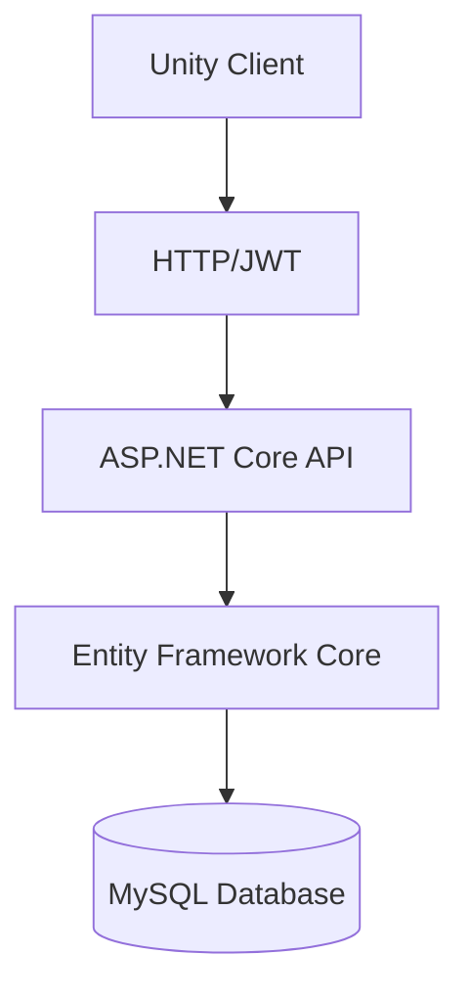

# 系统架构图

当前项目采用 Unity 客户端、ASP.NET Core API 与 MySQL 数据库的分层架构。

| 层次 | 当前项目职责 |
| --- | --- |
| Unity Client | 使用 C#、UGUI 展示登录、主页、好友、聊天与动态界面；通过统一 ApiClient 发起请求 |
| HTTP/JWT | HTTP 传输 JSON；受保护接口通过 Authorization: Bearer 携带 JWT，由服务端验证身份 |
| ASP.NET Core API | 使用 Controllers 与 Services 处理路由、参数验证、权限检查和业务逻辑 |
| Entity Framework Core | 通过 SocialDbContext 和实体映射执行查询、写入与事务，使用 Pomelo MySQL Provider |
| MySQL Database | 在 social_system 中保存用户、好友申请、好友关系、消息、动态、评论和点赞 |

HTTP/JWT 表示客户端与 API 之间的通信和认证方式，不是独立服务。注册和登录接口不要求 JWT。Unity 不直接连接 MySQL，所有业务数据访问均经过后端 API。

详细设计与接口说明见 [项目文档](PROJECT_DOCUMENTATION.md)。
