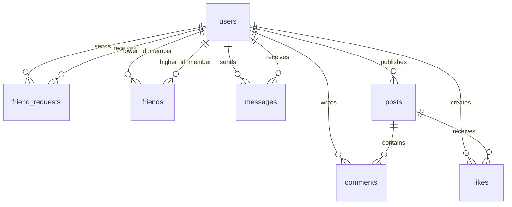

# social_system 数据库设计

本阶段固定 MySQL 8.0（目标验证版本 8.0.46）；后续使用 .NET 9、ASP.NET Core 9、EF Core 9.x 与 Pomelo 9.0.0。

## E-R 关系

用户之间的好友关系是自关联多对多关系，通过 friends 表表达。用户与动态的点赞关系也是多对多关系，通过 likes 表表达。申请与好友关系分开保存，已接受申请是历史记录，不代表双方现在仍然是好友。

## 通用约定

- 所有表采用 InnoDB、utf8mb4、utf8mb4_0900_ai_ci；用户名和密码哈希为明确的 ASCII 字段例外。
- 标识使用有符号 BIGINT，对应 C# long；除 likes 联合主键外，各表 id 为自增主键。
- 下表未标注“可空”的字段全部 NOT NULL。自增 id 无需调用者提供。
- 时间字段均为 DATETIME(6)，保存 UTC；初始化与验证脚本设置会话时区为 +00:00。后端每个连接也必须使用 UTC 会话或显式写入 UTC，不能依赖操作系统本地时区。
- created_at 默认 CURRENT_TIMESTAMP(6)。用户 updated_at 默认同值，并在资料行变化时自动更新。
- 用户外键均限制删除和主键修改。DDL 省略 ON DELETE / ON UPDATE 时，MySQL InnoDB 默认 NO ACTION，效果为立即 RESTRICT。
- posts 的删除级联到 comments 和 likes；不提供删除用户功能。
- MySQL 至少 8.0.16，确保 CHECK 被执行；使用严格 SQL 模式，避免超长值被静默截断。

## users：用户

| 字段 | 类型 / 默认值 | 含义与约束 |
| --- | --- | --- |
| id | BIGINT AUTO_INCREMENT | 主键 |
| username | VARCHAR(32)，ascii_general_ci | 登录名，唯一，大小写不敏感；3–32 位字母、数字、下划线 |
| password_hash | VARCHAR(512)，ascii_bin | 密码哈希，不得为空串；保存 PasswordHasher 输出，不存明文或可逆密文 |
| nickname | VARCHAR(32) | 中文昵称，允许重复，不得为空或仅普通空格 |
| bio | VARCHAR(200)，默认空串 | 个人简介 |
| avatar_key | VARCHAR(64)，默认 default | 客户端预置头像标识，不包含上传文件 |
| created_at | DATETIME(6)，默认当前时间 | 注册时间 |
| updated_at | DATETIME(6)，自动更新时间 | 资料修改时间 |

索引：PRIMARY KEY(id)、uq_users_username(username)、ix_users_nickname(nickname)。昵称索引适合前缀查找，不能承诺加速 `%关键词%` 查询。后端统一规范化用户名大小写，但数据库本身也能阻止大小写变体重复。

数据库无法证明一个字符串是安全的密码哈希，必须由后端 PasswordHasher 生成、验证。验证 SQL 仅使用随机密码的真实 Identity V3 PBKDF2-SHA512 哈希，随机密码已丢弃，不提供测试登录账号。

## friend_requests：好友申请

| 字段 | 类型 / 默认值 | 含义与约束 |
| --- | --- | --- |
| id | BIGINT AUTO_INCREMENT | 主键 |
| sender_id | BIGINT | FK → users.id，申请人 |
| receiver_id | BIGINT | FK → users.id，接收人，不能等于申请人 |
| status | TINYINT，默认 0 | CHECK：0 Pending、1 Accepted、2 Rejected |
| created_at | DATETIME(6)，默认当前时间 | 申请时间 |
| handled_at | DATETIME(6)，可空，默认 NULL | Pending 必须为空；已处理必须非空且不早于 created_at |
| pending_low_id | BIGINT，可空，VIRTUAL 生成列 | Pending 时取双方较小 ID，否则 NULL；不可手动写入 |
| pending_high_id | BIGINT，可空，VIRTUAL 生成列 | Pending 时取双方较大 ID，否则 NULL；不可手动写入 |

索引：PRIMARY KEY(id)、UNIQUE uq_friend_requests_pending_pair(pending_low_id,pending_high_id)、ix_friend_requests_receiver_status_id(receiver_id,status,id)、ix_friend_requests_sender_id(sender_id,id)。

生成列唯一索引保证同一对用户最多一个待处理申请，包含反向同时申请的情形。已处理记录的生成列均为 NULL，允许保留多次历史申请。拒绝后可以重发，已成为好友时是否允许申请由后端禁止。

接受申请时，后端须在同一事务中检查并锁定待处理申请、验证当前用户为接收者、修改状态和插入 friends。SQL 不自动创建好友，也不使用触发器实现业务。

## friends：当前好友关系

| 字段 | 类型 / 默认值 | 含义与约束 |
| --- | --- | --- |
| id | BIGINT AUTO_INCREMENT | 主键 |
| user_low_id | BIGINT | FK → users.id，较小用户 ID |
| user_high_id | BIGINT | FK → users.id，较大用户 ID |
| created_at | DATETIME(6)，默认当前时间 | 本次成为好友时间 |

索引：PRIMARY KEY(id)、UNIQUE uq_friends_pair(user_low_id,user_high_id)、ix_friends_high_id(user_high_id)。CHECK(user_low_id < user_high_id) 同时防止自加好友和反向重复。

一对好友只存一行。查列表需匹配 low 或 high 两端，并取另一端的用户资料。删除这一行即解除双方关系，不删除申请历史或聊天记录。重新成为好友时创建新关系行。

## messages：私聊消息

| 字段 | 类型 / 默认值 | 含义与约束 |
| --- | --- | --- |
| id | BIGINT AUTO_INCREMENT | 主键，分页游标 |
| sender_id | BIGINT | FK → users.id，发送者 |
| receiver_id | BIGINT | FK → users.id，接收者；CHECK 与发送者不同 |
| content | VARCHAR(2000) | 文字内容，不得为空或仅普通空格 |
| created_at | DATETIME(6)，默认当前时间 | 发送时间 |

索引：PRIMARY KEY(id)、ix_messages_sender_receiver_id(sender_id,receiver_id,id)、ix_messages_receiver_sender_id(receiver_id,sender_id,id)。

消息只引用用户，不引用 friends，因此解除好友关系不会删除聊天历史。仅好友可发送、仅会话双方可读取，均由后端检查；不是外键能保证的规则。首版不增加会话表、已读回执或群聊。

## posts：文字动态

| 字段 | 类型 / 默认值 | 含义与约束 |
| --- | --- | --- |
| id | BIGINT AUTO_INCREMENT | 主键，动态广场分页游标 |
| user_id | BIGINT | FK → users.id，作者 |
| content | VARCHAR(2000) | 动态正文，不得为空或仅普通空格 |
| created_at | DATETIME(6)，默认当前时间 | 发布时间 |

索引：PRIMARY KEY(id)、ix_posts_user_id(user_id,id)。首版所有登录用户可见文字广场，作者可删除自己的动态。权限由后端执行。

## comments：一级评论

| 字段 | 类型 / 默认值 | 含义与约束 |
| --- | --- | --- |
| id | BIGINT AUTO_INCREMENT | 主键 |
| post_id | BIGINT | FK → posts.id，ON DELETE CASCADE |
| user_id | BIGINT | FK → users.id，评论作者 |
| content | VARCHAR(500) | 评论正文，不得为空或仅普通空格 |
| created_at | DATETIME(6)，默认当前时间 | 评论时间 |

索引：PRIMARY KEY(id)、ix_comments_post_id(post_id,id)、ix_comments_user_id(user_id)。首版只实现一级评论，不引入父评论 ID。

## likes：点赞关系

| 字段 | 类型 / 默认值 | 含义与约束 |
| --- | --- | --- |
| post_id | BIGINT | 联合主键第一列；FK → posts.id，ON DELETE CASCADE |
| user_id | BIGINT | 联合主键第二列；FK → users.id |
| created_at | DATETIME(6)，默认当前时间 | 点赞时间 |

索引：PRIMARY KEY(post_id,user_id)、ix_likes_user_id(user_id)。联合主键在并发下也能防止重复点赞。取消点赞删除这行，重复点赞/取消请求的幂等响应由后端处理。

## 设计边界与检查结论

- 7 张表、11 条外键、12 条 CHECK；所有外键有相应左前缀索引支持。
- 不重复保存好友昵称、消息发送者昵称、动态作者资料，不保存可计算的点赞数或评论数。
- 数据库 TRIM 校验覆盖空串和普通空格；制表符、换行及 Unicode 空白、头像有效值等仍需后端参数验证。
- 待处理申请唯一约束与好友唯一约束各自保证表内一致性；跨表状态、当前好友才能发消息、操作者身份和状态转换必须由后端事务及权限检查保证。
- 初始化脚本不删除或覆盖已有表。它面向首次空库执行，并非可反复运行的迁移工具；MySQL DDL 会隐式提交，中途失败后须先检查现有结构。
- 本阶段不创建管理员账号、不保存连接密码、不实现 API、触发器或业务存储过程。验证脚本中的临时存储过程仅执行断言，结束后删除。

MySQL 参考：[生成列](https://dev.mysql.com/doc/refman/8.0/en/create-table-generated-columns.html)、[CHECK 约束](https://dev.mysql.com/doc/refman/8.0/en/create-table-check-constraints.html)、[外键](https://dev.mysql.com/doc/refman/8.0/en/create-table-foreign-keys.html)。
