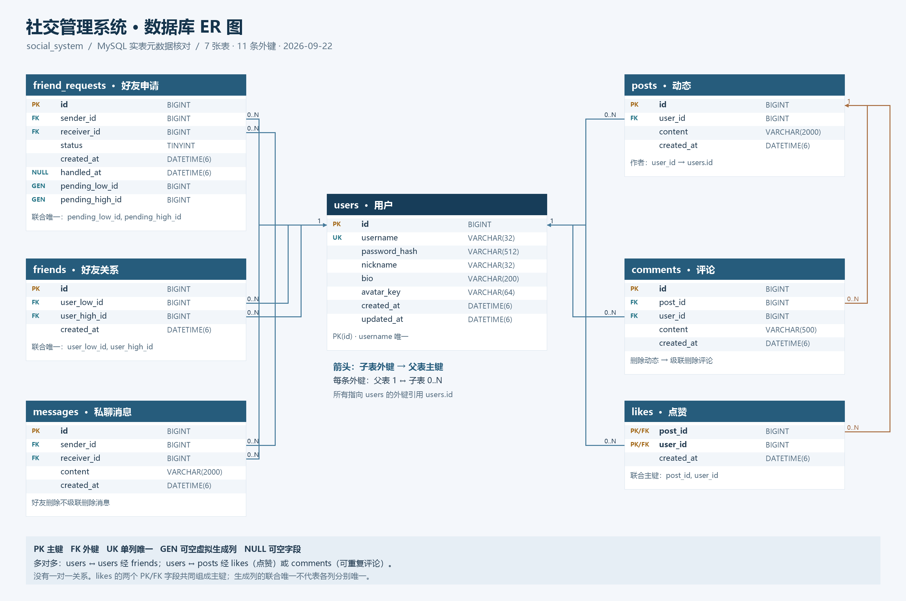
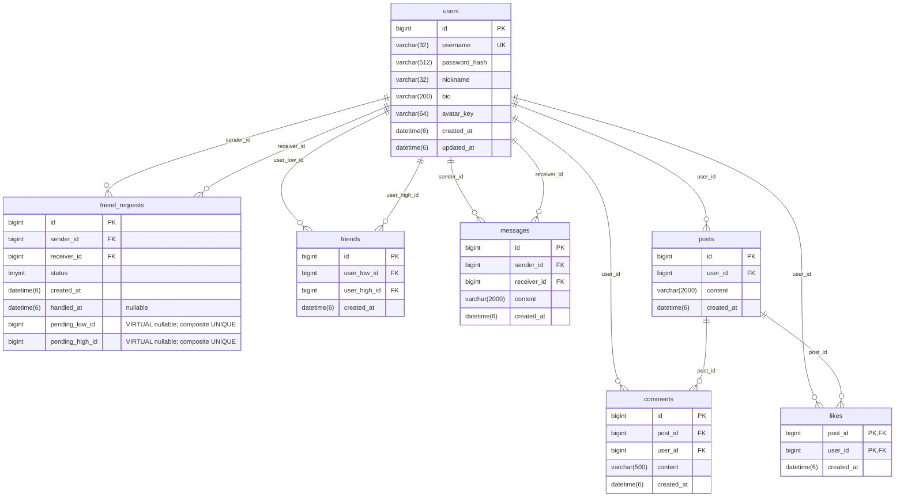

# 数据库 ER 图

核对日期：2026-09-22。数据库：`social_system`。

本图基于本机 MySQL 的实际结构：使用项目既有连接配置，只读查询 `information_schema.COLUMNS`、`KEY_COLUMN_USAGE`、`REFERENTIAL_CONSTRAINTS` 和 `STATISTICS`，并与 [建表定义](../database/01_init.sql) 对照。确认 7 张核心表、37 个字段、7 个主键及 11 条外键；未读取业务记录，未执行建表、迁移或数据修改。

## 答辩展示图片

- [PNG 高清图片（2800 × 1860）](diagrams/database_ER.png)：可直接插入答辩幻灯片。
- [SVG 矢量图片](diagrams/database_ER.svg)：适合放大展示与打印。

图片中的箭头从子表外键指向父表主键；每条关系均标明父表 `1`、子表 `0..N`。Mermaid 图采用标准实体关系基数符号，两者表达同一结构。

## 完整实体关系图

图例：

| 标记 | 含义 |
| --- | --- |
| PK | 主键；likes 中两个字段共同组成复合主键 |
| FK | 外键，引用其他表的主键 |
| UK | 单列唯一约束，此处仅 username |
| `||--o{` | 左侧每条记录可被右侧零到多条记录引用；每条右侧记录必须引用恰好一条左侧记录 |
| nullable | 允许 NULL |
| VIRTUAL | 数据库计算的虚拟生成列，不能当作普通字段写入 |

除 `handled_at` 和两个虚拟生成列可空外，其他字段均为 NOT NULL。除 likes 使用复合主键外，其他 6 张表的 id 均自增。所有时间字段精度为 DATETIME(6)。

## 主键与唯一约束

| 表 | 主键 | 其他唯一约束 |
| --- | --- | --- |
| users | id | username |
| friend_requests | id | (pending_low_id, pending_high_id)，联合唯一 |
| friends | id | (user_low_id, user_high_id)，联合唯一 |
| messages | id | 无 |
| posts | id | 无 |
| comments | id | 无 |
| likes | (post_id, user_id)，复合主键 | 由复合主键限制同一用户对同一动态最多一条点赞 |

联合唯一不表示组合中的每个字段分别唯一。friend_requests 的生成列不是外键：当 status=0 时分别取 sender_id、receiver_id 的较小值和较大值，否则为 NULL；联合唯一用于阻止同一对用户的双向重复待处理申请。

## 全部外键与一对多关系

下表按“父表 → 子表”阅读。11 条外键均非空，因此每条子记录在该角色上必须对应一条父记录；父记录可以尚无子记录。

| 父表主键 | 子表外键 | 基数 | 含义 | 删除父记录时 |
| --- | --- | --- | --- | --- |
| users.id | friend_requests.sender_id | 1 : 0..N | 用户发送申请 | NO ACTION |
| users.id | friend_requests.receiver_id | 1 : 0..N | 用户接收申请 | NO ACTION |
| users.id | friends.user_low_id | 1 : 0..N | 好友关系中 ID 较小的一方 | NO ACTION |
| users.id | friends.user_high_id | 1 : 0..N | 好友关系中 ID 较大的一方 | NO ACTION |
| users.id | messages.sender_id | 1 : 0..N | 用户发送消息 | NO ACTION |
| users.id | messages.receiver_id | 1 : 0..N | 用户接收消息 | NO ACTION |
| users.id | posts.user_id | 1 : 0..N | 用户发布动态 | NO ACTION |
| users.id | comments.user_id | 1 : 0..N | 用户提交评论 | NO ACTION |
| users.id | likes.user_id | 1 : 0..N | 用户点赞 | NO ACTION |
| posts.id | comments.post_id | 1 : 0..N | 动态包含评论 | CASCADE |
| posts.id | likes.post_id | 1 : 0..N | 动态获得点赞 | CASCADE |

NO ACTION 在 MySQL InnoDB 中表示存在引用时阻止删除；CASCADE 表示删除动态时一并删除其评论、点赞。图中没有虚构 messages → friends 或 friend_requests → friends 的外键。

## 一对一与多对多关系说明

### 一对一

**当前 7 张表之间没有由外键及唯一约束建立的一对一关系。** 不为满足图示而添加不存在的关系。users.username 唯一只是用户表内的约束，不是一对一表关系。

### 多对多

多对多在物理表中通过两条一对多关系实现：

| 逻辑关系 | 中间表 | 说明 |
| --- | --- | --- |
| 用户 ↔ 用户：好友 | friends | 自关联多对多。一名用户可有多位好友；每条记录保存一对用户，user_low_id < user_high_id，联合唯一防止反向或重复记录 |
| 用户 ↔ 动态：点赞 | likes | 一名用户可点赞多条动态，一条动态可被多名用户点赞；复合主键保证每对用户/动态只有一条点赞 |
| 用户 ↔ 动态：评论 | comments | 一名用户可评论多条动态，一条动态可由多名用户评论；同一用户对同一动态允许多次评论，因此没有 (post_id,user_id) 唯一约束 |
| 用户 ↔ 用户：申请交互 | friend_requests | sender、receiver 两个角色关联用户；记录申请事件与历史，不等同于当前好友关系 |
| 用户 ↔ 用户：消息交互 | messages | sender、receiver 两个角色关联用户；同一对用户可有多条消息，是消息事件记录而不是唯一联系人表 |

Mermaid 展示的是实际外键关系，不额外绘制代表虚拟表或不存在外键的多对多连线。

## 与业务行为的对应

- 好友申请与当前好友关系分别存储；接受申请后的历史记录不代表双方始终是好友。
- 删除好友仅删除 friends 关系记录。messages 没有引用 friends，所以不会因解除好友关系而被级联删除；能否继续发送由后端业务规则检查。
- 删除动态级联清理评论与点赞，不删除评论者或点赞者。
- pending_low_id、pending_high_id 是可空生成列，不是额外用户实体，也不是独立外键。
- 数据库的 bio、avatar_key、申请拒绝状态属于已有结构，不代表客户端已实现资料编辑、头像上传或拒绝申请界面。

更多字段默认值、CHECK 和普通索引说明见 [数据库设计](database-design.md)，整体项目功能见 [项目文档](PROJECT_DOCUMENTATION.md)。后续核对实库可使用 [只读检查 SQL](../database/02_inspect.sql)，无需执行初始化或约束写入测试。
